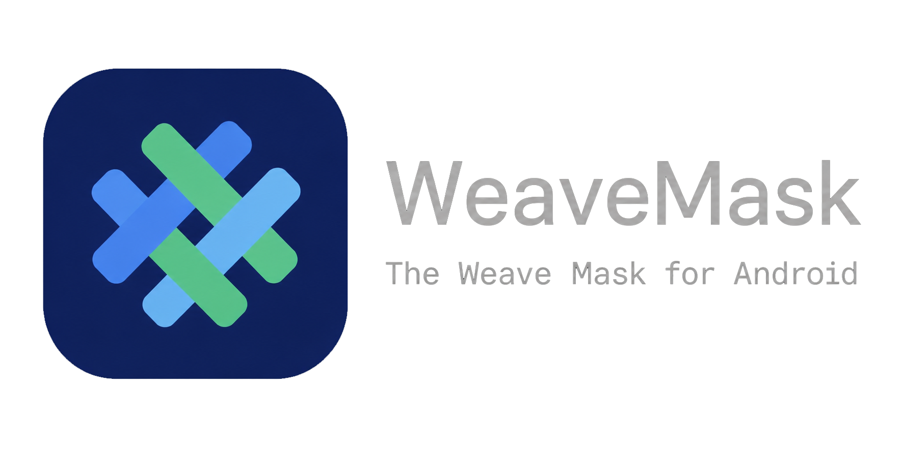

[English](README.md) | 简体中文

# WeaveMask

基于 Magisk 的 Miuix UI 增强分支。

## 功能特性

- **MagiskSU**: 为应用提供 Root 权限
- **Magisk 模块**: 通过安装模块修改只读分区
- **MagiskBoot**: 最完整的 Android 镜像解包与重打包工具
- **Zygisk**: 在每个 Android 应用进程中运行代码
- **白名单模式**: 自动将所有非系统应用加入 DenyList，仅显式授权的应用可获取 Root。与 Zygisk Next 双向同步。
- **模块仓库**: 内置浏览 [KernelSU 模块仓库](https://modules.kernelsu.org)
- **WebUI**: 支持模块 Web 界面，集成 Material You 取色
- **自定义设置**: 6 种主题模式、Material You 取色、双首页布局 (经典 / Weavsk)、模糊效果、浮动底栏、页面缩放、多图标切换

## 下载

- [GitHub Releases](https://github.com/Seyud/WeaveMask/releases)
- [Telegram 频道](https://t.me/WeaveMask)

## 相关链接

- [安装教程](https://seyud.github.io/WeaveMask/install.html)
- [构建与开发](https://seyud.github.io/WeaveMask/build.html)
- [WeaveMask 文档](https://seyud.github.io/WeaveMask/)
- [Zygisk 模块示例](https://github.com/topjohnwu/zygisk-module-sample)

## 问题反馈

**仅接受来自 Debug 构建的问题反馈。**

- 安装问题：请上传镜像文件和安装日志
- WeaveMask 问题：请上传 boot logcat 或 dmesg
- 应用崩溃：请录制并上传崩溃时的 logcat

请在 [GitHub Issues](https://github.com/Seyud/WeaveMask/issues) 提交问题。

## 翻译贡献

WeaveMask 应用及 stub APK 的默认字符串资源位于：

- `app/core/src/main/res/values/strings.xml`
- `app/stub-res/src/main/res/values/strings.xml`

请翻译后放置到对应位置 (`[module]/src/main/res/values-[lang]/strings.xml`)。

## 鸣谢

- [Magisk](https://github.com/topjohnwu/Magisk)
- [Miuix](https://github.com/compose-miuix-ui/miuix)
- [KernelSU](https://github.com/tiann/KernelSU)
- [InstallerX-Revived](https://github.com/wxxsfxyzm/InstallerX-Revived)

## 许可证

    WeaveMask 及所有 git 子模块均为自由软件：
    您可以按照自由软件基金会发布的 GNU 通用公共许可证第 3 版
    或（您选择的）更高版本的条款重新分发和/或修改本程序。

    本程序的发布希望它能有用，但没有任何保证；
    甚至没有隐含的适销性或特定用途适用性的保证。
    有关更多详细信息，请参阅 GNU 通用公共许可证。

    您应已收到 GNU 通用公共许可证的副本。
    如果没有，请参阅 <http://www.gnu.org/licenses/>。
